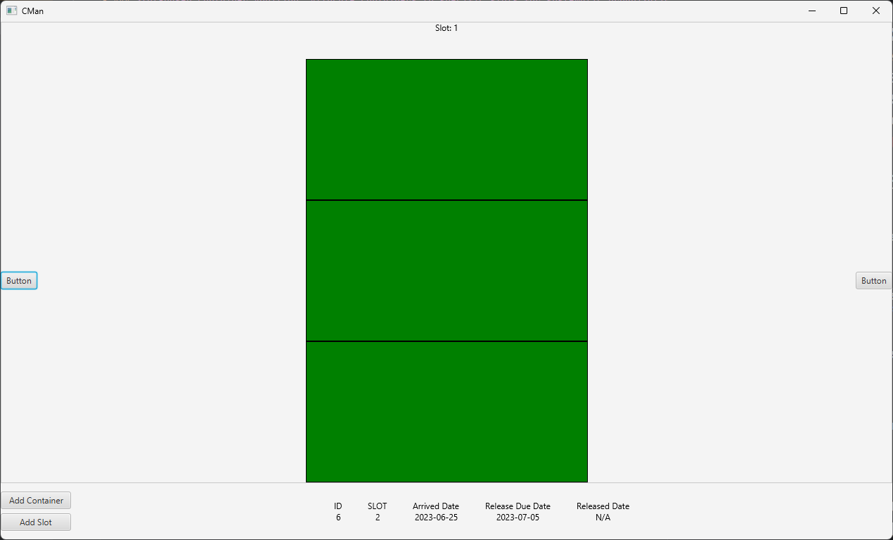

# <h1 align="center">Shipping Container Manager (Beta)</h1>
## <h2 align="center">A comprehensive JavaFX-based application tailored for efficient shipping container management. This robust manager provides a seamless interface for handling container logistics, offering a range of features:</h2>

> This Project is not finished yet.

- ### Slot-based Container Addition: Allocate containers to specific slots for systematic organization.
- ### Cargo Tracking: Log crucial details such as arrival, release, and due dates for precise cargo management.
- ### Identification & Description: Assign unique IDs to containers, along with brief descriptions for quick reference.
- ### Intuitive User Interface: Utilizes JavaFX to deliver an intuitive and visually appealing user experience.
- ### Search & Retrieval: Facilitates quick search functionalities to locate containers within the system effortlessly.
 
## Features 

 ## 1. Add container with some details 

    

### You can add slot number ,arrived date, release due date and color for the container

## This project is designed to streamline container logistics, enabling logistics companies and shipping entities to manage their cargo effectively. The application's user-friendly interface simplifies the complexities of container tracking and organization, making it an ideal solution for optimizing logistical workflows

### If you're interested in custom application development or would like to discuss a project, please don't hesitate to contact me.

<ul>
    <li><a href="https://twitter.com/Heshantk">Twitter</a></li>
    <li><a href="https://www.linkedin.com/in/heshanthenura">LinkedIn</a></li>
    <li><a href="https://www.instagram.com/heshan_thenura/">Instagram</a></li>
    <li><a href="https://youtube.com/@heshanthenura">YouTube</a></li>
    <li><a href="https://www.tiktok.com/@heshanthenura">TikTok</a></li>
</ul>

### [E-Mail](mailto:heshanthenura@protonmail.com) heshanthenura@protonmail.com
